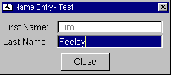

<div align="center">

## Active Text Box


</div>

### Description

A beginner's guide to customizing ActiveX controls and creating a 'template' for frequently used control procedures. Included is a group, which incudes a test application and the OCX source code. The code template is in no way complete. Suggested additions are: adding font properties to active/deactive box, border properties, etc
 
### More Info
 
Included is a group, which incudes a test application and the OCX source code. The code templayes are in no way complete. Suggested additions are: adding font properties to active/deactive box, border properties, etc.

Viral Infection (cold, flu), Nausea, Dysmenorrhea,

Drowsiness, Dyspepsia and/or Fatigue.


<span>             |<span>
---                |---
**Submitted On**   |2000-08-27 12:24:28
**By**             |[Tim Feeley](https://github.com/Planet-Source-Code/PSCIndex/blob/master/ByAuthor/tim-feeley.md)
**Level**          |Beginner
**User Rating**    |4.3 (13 globes from 3 users)
**Compatibility**  |VB 6\.0
**Category**       |[OLE/ COM/ DCOM/ Active\-X](https://github.com/Planet-Source-Code/PSCIndex/blob/master/ByCategory/ole-com-dcom-active-x__1-29.md)
**World**          |[Visual Basic](https://github.com/Planet-Source-Code/PSCIndex/blob/master/ByWorld/visual-basic.md)
**Archive File**   |[CODE\_UPLOAD93468272000\.zip](https://github.com/Planet-Source-Code/tim-feeley-active-text-box__1-11030/archive/master.zip)

### API Declarations

```
'Enjoy! Remember, this is only a base for what you may do with such 'buddy' controls.
'Minimal side effects which are shown in less than 10% of users, including:
'Viral Infection (cold, flu), Nausea,
'Dysmenorrhea, Drowsiness, Dyspepsia
'and/or Fatigue.
```


